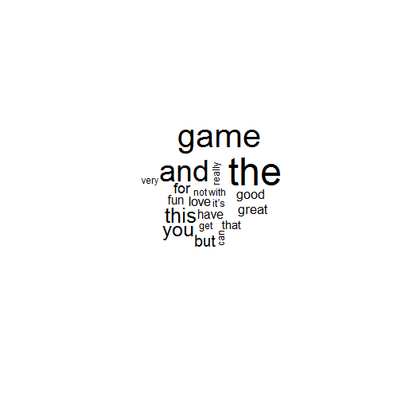

## 

<q> 
A <b> <font color="red">tag cloud (word cloud, or weighted list in visual design)</font></b> is a visual representation for text data, typically used to depict keyword metadata (tags) on websites, or to visualize free form text. Tags are usually single words, and the importance of each tag is shown with font size or color.</q>

<style>
.dark q {
  color: green;
}
</style>


--- .class #id 

## A Look at my application
  
 <br>

--- .middle 


## Reading a csv file and generating word cloud in .Rmd file


```
## 'data.frame':	1000 obs. of  4 variables:
##  $ X       : int  1 2 3 4 5 6 7 8 9 10 ...
##  $ rating  : int  5 5 5 5 5 1 3 5 4 4 ...
##  $ location: chr  "us" "us" "nz" "gb" ...
##  $ text    : chr  " SO ADDICTING  DEFF DOWNLAOD ITS EPIC YOU CAT LOVERS WILL FALL IN LOVE <3" " Great game I love this game. Unlike other games they constantly give you money to play. They are always given you a bone. Keep"| __truncated__ " Sooo much FUN I would definitely recommend this game, it's fun for dress up and business. It's extremely entertaining, I'm hoo"| __truncated__ " AWESOME Epic game so addictive 5stars <f0><U+009F><U+0098><U+0084>" ...
```

 
--- .middle 


##

## Always the speech is about what?
 Seven years <br>
 One President<br>

  <b> <font color="red"> jobs, work, people, economy</font></b><br>
  
  <table  style="width:50%">
  <tr>
    <td> </td>
   <td> </td>
    
  </tr>
  <tr>
    <td>
    <td>
  </tr>
</table>

